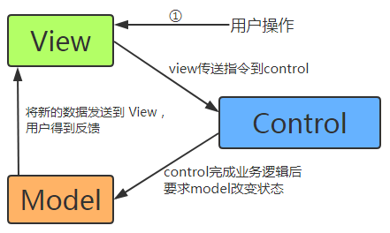
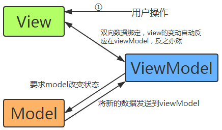
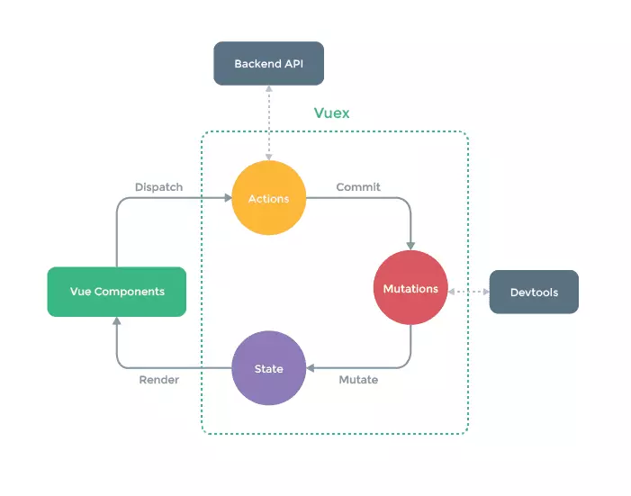

# 关于vue的内容

## 对MVVM的理解，及其与MVC的区别

MVVM和MVC都是前端架构方式（架构模式），它通过分离关注点来改进代码组织方式。不同于设计模式(Design Pattern),只是为了解决一类问题而总结出的抽象方法，一种架构模式往往能使用多种设计模式。

MVVM是Model-View-ViewModel的缩写。MVC是Model-View-Controller的缩写。其中，Model和View都是同一个意思。

- Model（模型）：数据模型。
- View（视图）：呈现给用户的界面
- ViewModel（视图模型）：监听模型数据的改变和控制视图行为、处理用户交互。有了双向数据绑定，开发者只需关注业务逻辑，不需要关注数据状态的同步问题。
- Controller（控制器）：主要是用以连接Model和View的。

MVC与MVVM的区别：
 

- MVC各部分间通信都是单向的；MVVM中各部分通信都是双向的。
- mvvm主要解决了mvc中大量 dom操作使得页面渲染性能降低，加载速度变慢，影响用户体验。
- MVC和MVVM的区别并不是ViewModel完全取代了Controller，ViewModel存在目的在于抽离Controller中展示的业务逻辑，而不是替代Controller，

## vue的生命周期<钩子函数>（8个）

1. 什么是生命周期，及其作用？
    vue实例从创建到销毁的过程叫做生命周期。在生命周期中有多个事件钩子，让我们在控制vue实例的过程中更容易形成好的逻辑。
    - beforeCreate：vue实例创建前。数据观测和初始化事件还未开始，$el没有创建。
    - created：vue实例创建完成。数据观测、属性和方法的运算、初始化事件都完成了，$el还没有创建。
    - beforeMount：界面渲染前。render函数首次被调用，实例已完成编译模板，把data里面的数据和模板生成html。注意：html还没有挂载到页面上。
    - mounted：界面渲染完成，编译好的html已经挂在到页面上了，此时可以访问DOM了。
    - beforeUpdate：数据更新前。发生在DOM重新渲染前。
    - updated：数据更新完成,DOM已经更新。（**避免在此期间更改状态**，因为这可能会导致更新无限循环。）
    - beforeDestroy：vue实例销毁前。实例还可以正常使用。
    - destroyed：vue实例销毁完成。所有事件监听器被移除，所有子实例也被销毁。
2. 第一次页面加载会触发哪些钩子？
    beforeCreate -> created -> beforeMount -> mounted

## vue实现数据双向绑定的原理

vue实现数据双向绑定主要是：采用**数据劫持结合发布者-订阅者模式**的方式，通过`Object.defineProperty()`来劫持各个属性的setter，getter，在数据变动时发布消息给订阅者，触发相应监听回调。

当把一个普通 Javascript 对象传给 Vue 实例来作为它的 data 选项时，Vue 将遍历它的属性，用 `Object.defineProperty()`将它们转为 getter/setter。用户看不到 getter/setter，但是在内部它们让 Vue 追踪依赖，在属性被访问和修改时通知变化。

``` html
    <div class="content">
        <input type="text" id="text" />
        <p id="showText"></p>
    </div>
```

``` js
    let obj = {};
    let input = document.getElementById('text');
    Object.defineProperty(obj,'textValue',{
        get:function(){
            //这里需要一个返回值,不然console.log(obj.textValue)就会是undefined
            return input.value;//返回input的内容
        },
        set:function(newVal){
            input.value = newVal;
            let p = document.getElementById('showText');
            p.innerHtml = newVal;
        },
    });
    input.addEventListener('keyup',function(e){
        obj.textValue = e.target.value;
        console.log(obj.textValue);
    });
```

## vue组件间数据传递的方式有哪些

1. 父组件向子组件传递
    在父组件书写的子组件标签中通过属性（可以是动态属性）传递给子组件，在子组件中通过props属性接收父组件传过来的数据。
2. 子组件向父组件传递
    在子组件中通过`this.$emit('事件名',data)`将data传递给父组件，在父组件中通过在子组件标签中书写`@事件名="func"`在函数func中可以接收到data。
3. 通过vuex传递
    引用vuex，书写并引入store。在任一组件中都可以通过`commit`和`dispatch`将数据发送到store的`mutations`和`actions`属性中，进而将数据更新到store的state属性。在任一组件中，在计算属性computed中通过`this.$store.state.***`或`this.$store.getters.***`获取数据。

## vuex是什么？如何使用？什么情况适用？

vuex是vue的状态管理器，**vuex采用的是单一状态树即每个应用将仅仅包含一个store实例**。包括state、getters、mutations、actions、modules属性。

安装vuex，在项目的入口js中，引入store并注入。

适用于各非父子组件中需要频繁传递数据，或要共享的数据较多。例如：单页应用中，组件之间的状态、音乐播放、登录状态、加入购物车。

- state：存储数据。
- getters：相当于过滤器，可用来筛选部分数据。
- mutations：更新数据。监听数据是由谁提交。
- actions：更新数据，里面可以执行异步操作（如服务器请求），mutations不可以执行异步操作。特殊的是，actions收到的第一个参数不是state，而是一个context提交。需要在actions里面再commit到mutaions中。
- modules：模块划分。可以将每个模块中的数据单独分出来，便于管理。

vuex的数据传递及更新过程如下：（其中，dispatch到actions的过程不是必要的）


## vue路由的history模式和hash模式

hash模式：在浏览器中符号“#”，#以及#后面的字符称之为hash，用 window.location.hash 读取。特点：hash虽然在URL中，但不被包括在HTTP请求中；用来指导浏览器动作，对服务端安全无用，hash不会重加载页面。

history模式：history采用HTML5的新特性；且提供了两个新方法： pushState()， replaceState()可以对浏览器历史记录栈进行修改，以及popState事件的监听到状态变更。

## `$route`和`$router`的区别

`$route`是“路由信息对象”，包括path，params，hash，query，fullPath，matched，name等路由信息参数。
`$router`是“路由实例”对象,包括了路由的跳转方法，钩子函数等。

## vue-resource与axios

vue-resource已经停止维护了，vue2.0的版本推荐使用axios。

## uni-app

uni-app 是一个使用 Vue.js 开发跨平台应用的前端框架，开发者编写一套代码，可编译到iOS、Android、H5、小程序等多个平台。
具体介绍几使用方式查看[uni-app 官网](https://uniapp.dcloud.io/)